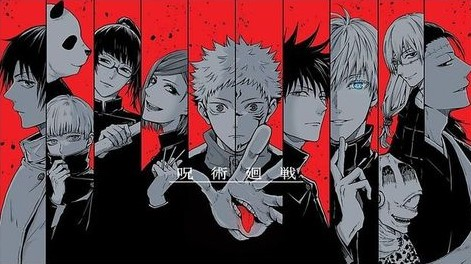

# Jujutsu Kaisen Page



## Descripción
Este proyecto es un taller sobre HTML, CSS y Bootstrap, donde se crea una página web dedicada a la popular serie de manga y anime "Jujutsu Kaisen". La página presenta información sobre la serie, sus personajes principales y utiliza técnicas de diseño responsive.

## Tecnologías Utilizadas
- HTML
- CSS
- Bootstrap

## Instalación
Para ver el proyecto en tu propio entorno, sigue estos pasos:

1. Clona este repositorio:
   ```bash
   git clone https://github.com/Joban-Mejia/Taller-HTML-CSS-BOOTSTRAP.git
